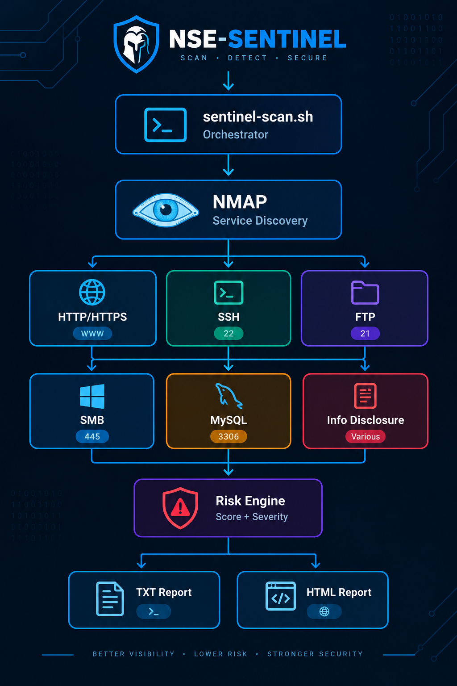

# NSE-Sentinel

### Custom Nmap NSE Security Auditing Toolkit

NSE-Sentinel is a modular security auditing toolkit built on top of **Nmap NSE (Nmap Scripting Engine)**.

The project provides custom NSE scripts for identifying common security weaknesses across network services and automatically aggregates the results into a **global risk assessment**.

The toolkit is designed for **authorized security assessments, security labs, penetration-testing environments, and defensive security research**.

---

## 🎯 Objectives

NSE-Sentinel aims to extend Nmap's native capabilities with a dedicated security-auditing layer that can:

* Discover exposed network services.
* Perform targeted security configuration audits.
* Identify weak or legacy security mechanisms.
* Detect information disclosure.
* Evaluate individual service risk.
* Aggregate findings into a global risk score.
* Generate human-readable security reports.
* Provide both terminal and HTML reporting.

The project focuses on **automated security assessment rather than exploitation**.

---

## 🏗️ Architecture



NSE-Sentinel follows a modular security auditing pipeline, from service
discovery and service-specific NSE audits to risk aggregation and report
generation.

---

## 🔍 Security Audits

NSE-Sentinel currently includes six custom NSE security audits.

| Audit                        | Service | Main Checks                                         |
| ---------------------------- | ------- | --------------------------------------------------- |
| HTTP Security Audit          | HTTP    | Security headers and server disclosure              |
| SSH Security Audit           | SSH     | Weak KEX, host keys, encryption and MAC algorithms  |
| FTP Security Audit           | FTP     | TLS, anonymous access and cleartext control channel |
| SMB Security Audit           | SMB     | SMBv1 and message signing                           |
| MySQL Security Audit         | MySQL   | Protocol capabilities and security features         |
| Information Disclosure Audit | HTTP    | Server, technology and HTML metadata disclosure     |

---

## 🛡️ HTTP Security Audit

The HTTP audit evaluates common security-hardening controls.

### Checks

* HSTS
* Content-Security-Policy
* X-Content-Type-Options
* X-Frame-Options
* Server information disclosure

### Example

```text
Findings:
  HSTS: MISSING [MEDIUM]
  Content-Security-Policy: MISSING [MEDIUM]
  X-Content-Type-Options: MISSING [LOW]
  X-Frame-Options: MISSING [LOW]
  Server Information Disclosure: PRESENT [LOW]

Risk Score: 40/100
Risk Level: MEDIUM
```

The audit supports HTTP services running on standard and non-standard ports.

---

## 🔐 SSH Security Audit

The SSH audit analyzes the algorithms advertised by the SSH server and identifies legacy or weak cryptographic mechanisms.

### Checks

* Weak key exchange algorithms
* SHA-1 based KEX
* DSA / `ssh-dss`
* Legacy RSA / `ssh-rsa`
* CBC encryption
* ARCFOUR
* 3DES
* MD5-based MAC algorithms

### Example

```text
Findings:
  Weak KEX: diffie-hellman-group1-sha1: WEAK [HIGH]
  Weak Host Key: ssh-dss: WEAK [HIGH]
  Weak Encryption: arcfour: WEAK [HIGH]
  Weak MAC: MD5: WEAK [HIGH]

Risk Score: 100/100
Risk Level: CRITICAL
```

This audit is focused on **cryptographic configuration assessment** and does not attempt authentication or exploitation.

---

## 📁 FTP Security Audit

The FTP audit evaluates the security of FTP services.

### Checks

* TLS support
* Cleartext FTP control channel
* Anonymous FTP access
* FTP server banner
* FTP features

The audit also handles FTP services running on **non-standard ports**.

Example:

```text
Port 21:
  TLS Support: NOT ADVERTISED
  Anonymous Access: ALLOWED

Risk Score: 55/100
Risk Level: MEDIUM

Port 2121:
  TLS Support: NOT ADVERTISED
  Anonymous Access: DENIED

Risk Score: 15/100
Risk Level: LOW
```

---

## 🖥️ SMB Security Audit

The SMB audit performs protocol-level security discovery.

### Checks

* SMB dialects
* SMBv1
* Authentication mode
* Challenge-response support
* Message signing
* Server information

Example:

```text
SMB Dialects:
  NT LM 0.12 (SMBv1)

Security Mode:
  Authentication: USER
  Challenge Response: SUPPORTED
  Message Signing: DISABLED

Findings:
  SMBv1 Enabled: WEAK [HIGH]
  SMB Message Signing Disabled: WEAK [HIGH]

Risk Score: 50/100
Risk Level: MEDIUM
```

---

## 🗄️ MySQL Security Audit

The MySQL audit performs a protocol handshake and evaluates advertised capabilities.

### Checks

* Protocol version
* MySQL version
* Server capabilities
* TLS support
* `LOAD DATA LOCAL`
* Compression
* 4.1 authentication support
* Authentication plugin information

The audit does **not** perform credential attacks or execute SQL queries.

Example:

```text
Protocol Version: 10
MySQL Version: 5.0.51a-3ubuntu5

TLS Support: ADVERTISED
LOAD DATA LOCAL: NOT ADVERTISED
Compression: SUPPORTED
4.1 Authentication: SUPPORTED

Findings:
  No MySQL protocol weaknesses detected

Risk Score: 0/100
Risk Level: INFORMATIONAL
```

---

## 🕵️ Information Disclosure Audit

The information-disclosure audit identifies unnecessary technology and implementation information exposed through HTTP responses and HTML content.

### Checks

* `Server`
* `X-Powered-By`
* `X-AspNet-Version`
* `X-AspNetMvc-Version`
* `X-Generator`
* `Via`
* HTML generator metadata
* HTML comments

Example:

```text
Server Version Disclosure:
  EXPOSED: Apache/2.2.8 (Ubuntu) DAV/2 [LOW]

Technology Stack Disclosure:
  EXPOSED: PHP/5.2.4-2ubuntu5.10 [LOW]

Risk Score: 10/100
Risk Level: LOW
```

---

# 📊 Risk Scoring

NSE-Sentinel uses a severity-weighted scoring model.

| Severity      | Weight |
| ------------- | -----: |
| Informational |      0 |
| Low           |      5 |
| Medium        |     15 |
| High          |     25 |
| Critical      |     40 |

A finding contributes to the score when its status is:

* `MISSING`
* `WEAK`

The resulting score is capped at **100**.

### Risk levels

|  Score | Risk Level    |
| -----: | ------------- |
|      0 | INFORMATIONAL |
|   1–29 | LOW           |
|  30–59 | MEDIUM        |
|  60–79 | HIGH          |
| 80–100 | CRITICAL      |

The scoring model is intentionally simple and transparent so that it can easily be extended or adapted.

---

# ⚙️ Installation

## Requirements

* Linux
* Nmap
* Nmap NSE
* Lua
* Bash

On Kali Linux:

```bash
sudo apt update
sudo apt install nmap lua5.4
```

Clone the repository:

```bash
git clone git@github.com:penelopeeckhar/nse-sentinel.git
cd nse-sentinel
```

Make the automation scripts executable:

```bash
chmod +x sentinel-scan.sh
chmod +x sentinel-report.sh
chmod +x sentinel-report-html.sh
```

---

# 🚀 Usage

## Full Security Scan

Run the complete audit against an authorized target:

```bash
sudo ./sentinel-scan.sh <TARGET>
```

Example:

```bash
sudo ./sentinel-scan.sh 192.168.56.107
```

The scanner automatically:

1. Performs service discovery.
2. Identifies supported services.
3. Executes the appropriate NSE audits.
4. Stores raw results.
5. Calculates risk scores.
6. Aggregates findings.
7. Generates a detailed TXT report.
8. Generates an HTML security report.

---

# 📄 Generated Reports

Reports are separated into two categories.

### Raw reports

```text
reports/raw/
```

Contains the individual Nmap and NSE audit outputs.

Example:

```text
192.168.56.107-baseline.txt
192.168.56.107-http-security-audit.txt
192.168.56.107-ssh-security-audit.txt
192.168.56.107-ftp-security-audit.txt
192.168.56.107-smb-security-audit.txt
192.168.56.107-mysql-security-audit.txt
192.168.56.107-info-disclosure-audit.txt
```

### Generated reports

```text
reports/generated/
```

Contains:

```text
192.168.56.107-security-summary.txt
192.168.56.107-security-report.html
```

Generated reports are excluded from Git using `.gitignore`.

---

# 📊 Example Assessment

The toolkit was validated in an isolated **Metasploitable 2** laboratory environment.

### Target

```text
192.168.56.107
```

### Audits

```text
6
```

### Overall result

```text
Overall Score: 100/100
Overall Level: CRITICAL
```

### Audit results

```text
SSH Security Audit               100/100    CRITICAL
FTP Security Audit                55/100    MEDIUM
SMB Security Audit                50/100    MEDIUM
HTTP Security Audit               40/100    MEDIUM
Information Disclosure Audit      10/100    LOW
MySQL Security Audit                0/100    INFORMATIONAL
```

### Findings

```text
Critical:       0
High:           7
Medium:        11
Low:           10
Informational:  0
```

The results demonstrate the complete workflow from service discovery to automated risk reporting.

---

# 📂 Project Structure

```text
nse-sentinel/
│
├── nse/
│   ├── ftp-security-audit.nse
│   ├── http-security-audit.nse
│   ├── info-disclosure-audit.nse
│   ├── mysql-security-audit.nse
│   ├── smb-security-audit.nse
│   └── ssh-security-audit.nse
│
├── lib/
│   └── sentinel_utils.lua
│
├── screenshots/
│   └── architecture.png
│
├── sentinel-scan.sh
├── sentinel-report.sh
├── sentinel-report-html.sh
│
├── README.md
├── LICENSE
└── .gitignore

---

# 🧪 Testing Environment

Development and validation were performed using:

```text
Host OS:
  Windows 11

Security Environment:
  Kali Linux

Virtualization:
  Oracle VirtualBox

Target:
  Metasploitable 2

Network:
  Isolated Host-Only laboratory network
```

The target used for testing is intentionally vulnerable and exists in an isolated security-training environment.

---

# 🔒 Security & Ethical Use

NSE-Sentinel is intended for:

* Authorized penetration testing
* Security assessments
* Cybersecurity laboratories
* CTF environments
* Defensive security research
* Educational purposes

**Only run NSE-Sentinel against systems for which you have explicit authorization to perform security testing.**

The project focuses on security auditing and protocol/configuration discovery and does not require exploitation to produce its assessments.

---

# 🔮 Future Improvements

Potential future developments include:

* Additional NSE security audits.
* CVE/CPE correlation.
* Configurable scoring profiles.
* JSON report generation.
* SARIF output.
* Improved HTML dashboards.
* Historical scan comparison.
* Risk trend visualization.
* CI/CD integration.
* Automated regression tests.
* Custom remediation databases.
* Parallel service auditing.
* Configuration through a central YAML file.

---

# 💡 Design Principles

NSE-Sentinel follows several design principles:

### Modular

Each security audit is implemented as an independent NSE script.

### Passive / Non-destructive

The audits prioritize protocol discovery and configuration analysis rather than exploitation.

### Automated

A single command can perform service discovery, auditing, scoring and reporting.

### Transparent

Risk calculations are based on an explicit severity-weighted model.

### Extensible

New audits can be added without redesigning the complete scanning pipeline.

---

# 🛠️ Technologies

* **Nmap**
* **Nmap NSE**
* **Lua**
* **Bash**
* **TCP/IP**
* **HTTP**
* **SSH**
* **FTP**
* **SMB**
* **MySQL**
* **Security assessment**
* **Risk scoring**
* **HTML reporting**

---

# 👩‍💻 Author

**Abir Majdi**

Cybersecurity Engineering Student
ENSA Fès

GitHub: **[@penelopeeckhar](https://github.com/penelopeeckhar)**

---

# 📜 License

This project is distributed under the license included in the repository.

See [`LICENSE`](LICENSE) for details.
